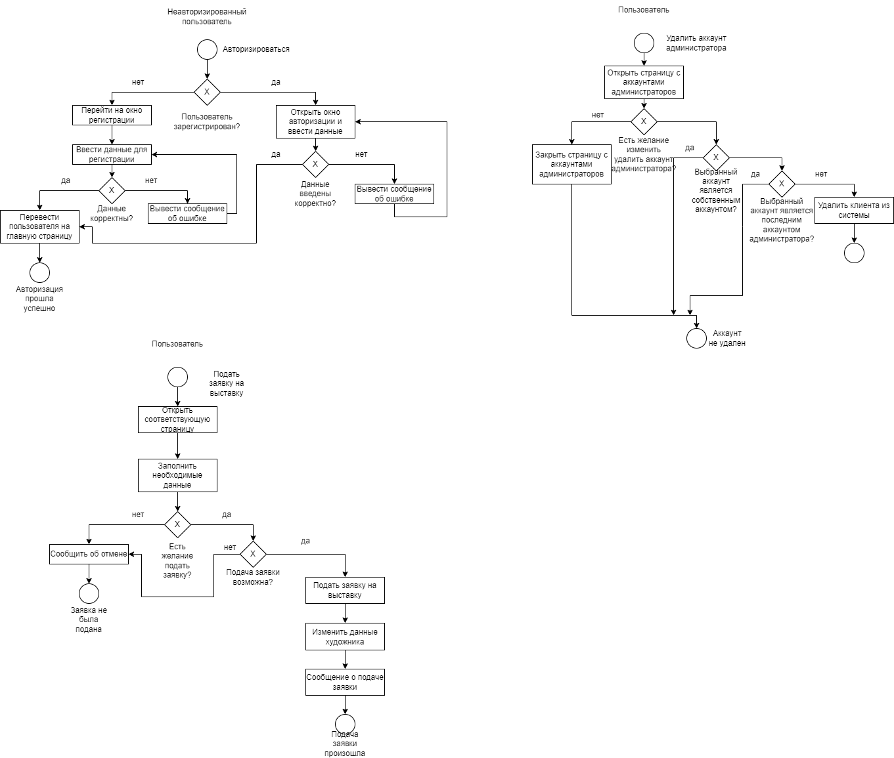
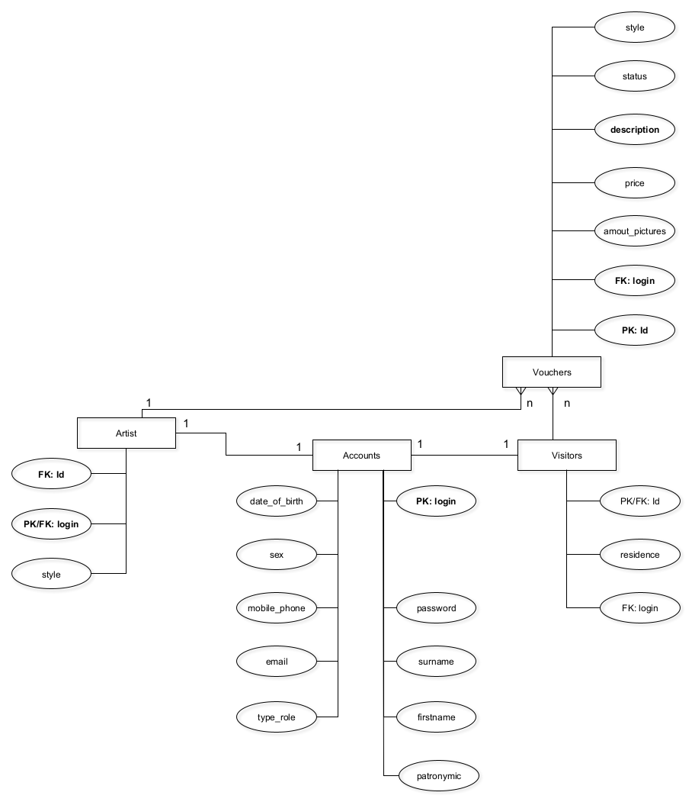
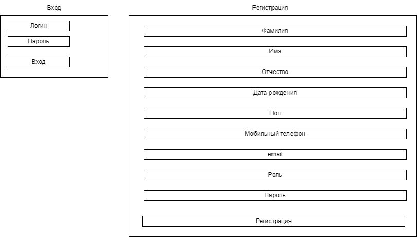
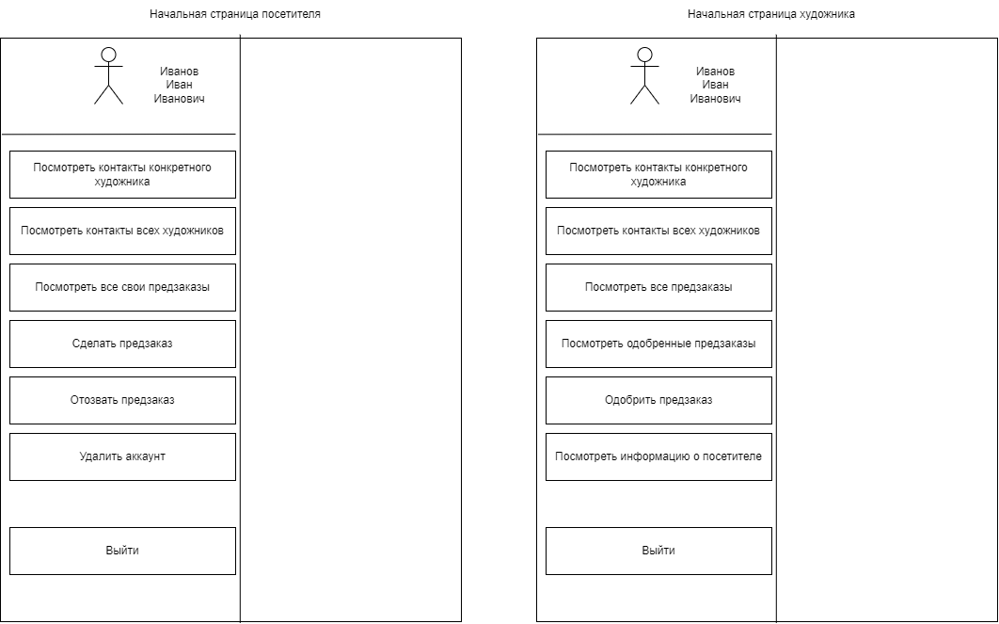
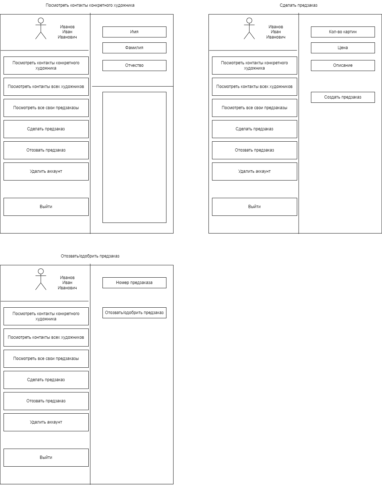
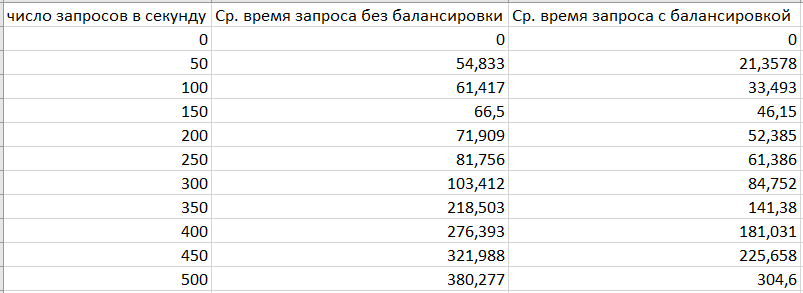
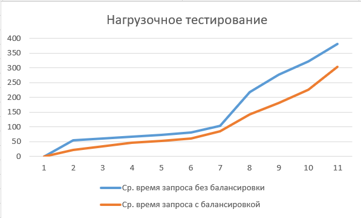

# web

## Цель работы, решаемая проблема/предоставляемая возможность

Реализовать программу с базой данных сообщества художников. Программа предоставляет возможность подачи заявки на предзаказ и его дальнейшее одобрение или отклонение. 

## Краткий перечень функциональных требований

Интерфейс для работы с данными о членах организации, предзаказах для различных категорий пользователей --- художника, посетителя. 
 
 Для каждого участника должен быть определён свой набор прав и разрешённых действий.

## Use-case диаграмма системы

## BPMN диаграмма основных бизнес-процессов

## Примеры описания основных пользовательских сценариев

Посетитель: вход в систему; посмотреть контакты конкретного художника; посмотреть контакты всех художников; просмотреть все свои предзаказы; сделать предзаказ; отозвать предзаказ.

Художник: вход в систему; посмотреть все предзаказы на выставку; посмотреть одобренные предзаказы на выставку; одобрить предзаказ на выставку.

Незарегистрированный пользователь: зарегистрироваться

## ER-диаграмма сущностей

## Диаграмма БД

## Компонентная диаграмма системы

 

## Экраны будущего web-приложения на уровне черновых эскизов

## UML диаграммы классов для компонента доступа к данным и компонента с бизнес-логикой

# Проведение нагрузочного тестирования

## Цель исследования

Целью исследования является проведение сравнительного анализа зависимости среднего времени ответа на запросы от числа запросов в секунду с использованием кеша и балансировки нагрузки и без.

## Наборы варьируемых и фиксируемых параметров

максимальное число пользователей (равно 500);

прирост пользователей в секунду (равно 50);

длительность нагрузочного тестирования (равно 1 минуте).

Для проведения исследования были отобраны запросы на выполнение трех действий в рамках созданной системы:

запрос на получение всех художников;
запрос на получение всех предзаказов;
запрос на получение всех посетителей.

В качестве кеша и балансировщика нагрузки использовался веб сервер nginx.

## Результаты нагрузочного тестирования

Среднее время ответа в зависимости от числа запросов в секунду без использования балансировки и с использованием балансировки

Анализируя выборки, представленные в таблицах выше, можно увидеть, что при числе запросов в секунду, меньших 250, среднее время ответа на запрос без использования балансировки и кеширования примерно в 2.71 больше, чем с использованием балансировки.

При числе запросов большем, чем 250, наблюдается увеличение среднего времени ответа на запрос в ситуации без использования балансировки.

Использование балансировки позволило увеличить максимальное число обрабатываемых запросов в секунду в 1.2 раза и уменьшить среднее время ответа в 1.3 раза.
