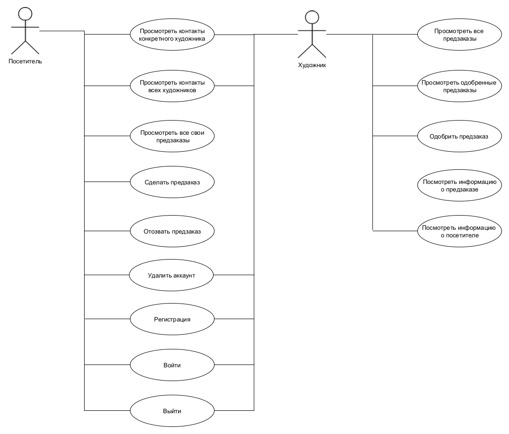
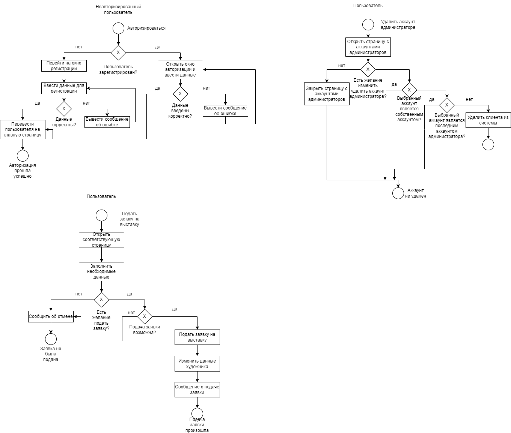
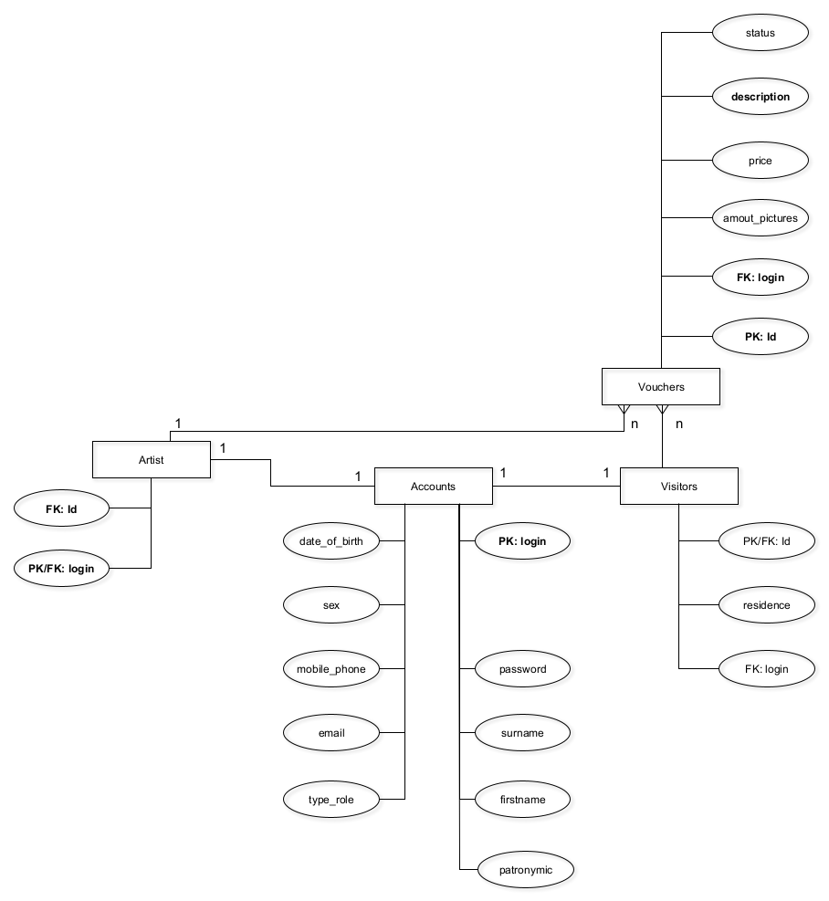
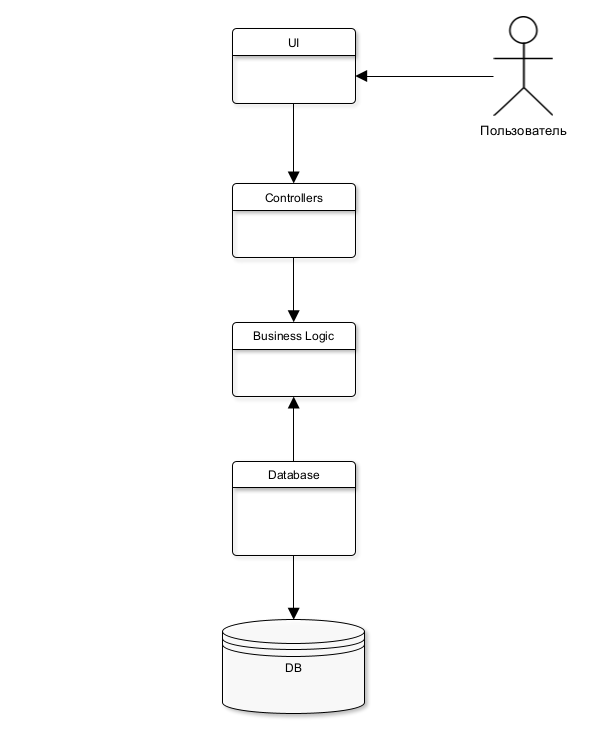
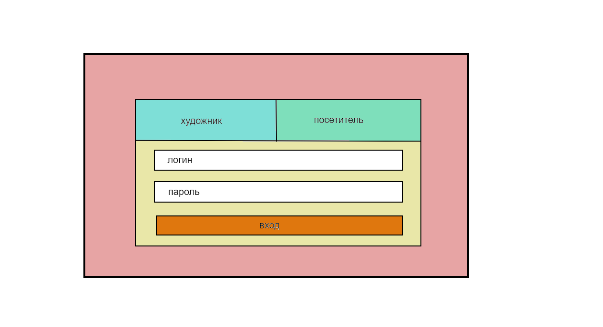
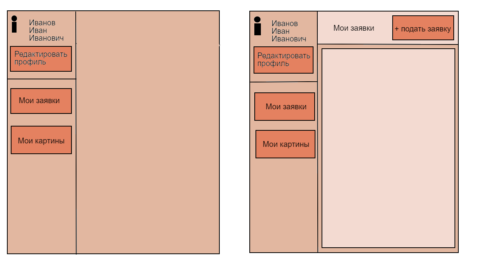
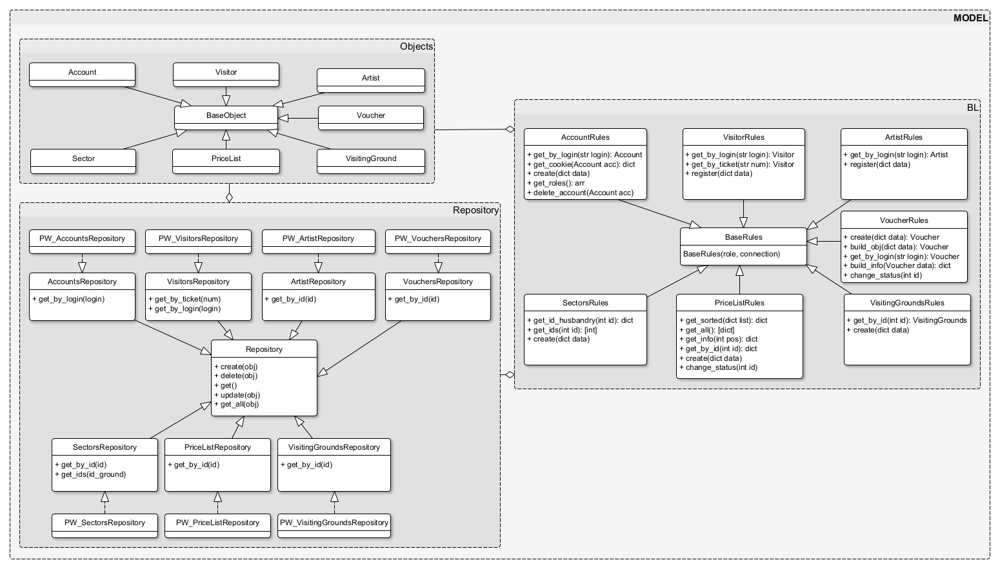

# web

## Цель работы, решаемая проблема/предоставляемая возможность

Реализовать программу с базой данных сообщества художников. Программа предоставляет возможность подачи заявки на предзаказ и его дальнейшее одобрение или отклонение. 

## Краткий перечень функциональных требований

Интерфейс для работы с данными о членах организации, предзаказах для различных категорий пользователей --- художника, посетителя. 
 
 Для каждого участника должен быть определён свой набор прав и разрешённых действий.

## Use-case диаграмма системы

## BPMN диаграмма основных бизнес-процессов

## Примеры описания основных пользовательских сценариев

Посетитель: вход в систему; посмотреть контакты конкретного художника; посмотреть контакты всех художников; просмотреть все свои предзаказы; сделать предзаказ; отозвать предзаказ.

Художник: вход в систему; посмотреть все предзаказы на выставку; посмотреть одобренные предзаказы на выставку; одобрить предзаказ на выставку.

Незарегистрированный пользователь: зарегистрироваться

## ER-диаграмма сущностей

## Диаграмма БД

## Компонентная диаграмма системы

 

## Экраны будущего web-приложения на уровне черновых эскизов

## UML диаграммы классов для компонента доступа к данным и компонента с бизнес-логикой

